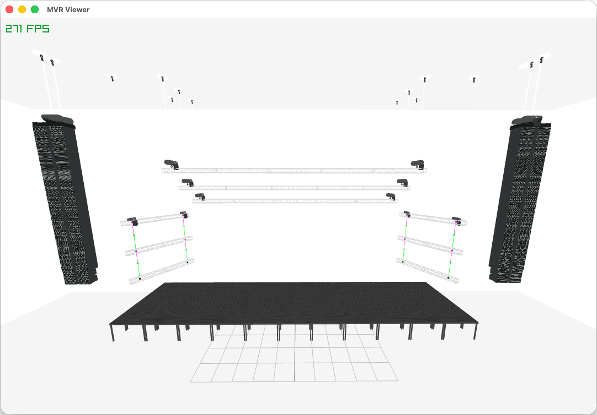

# rigger

A Rust library for reading [MVR](https://www.gdtf.eu/mvr/prologue/introduction/) and [GDTF](https://www.gdtf.eu/gdtf/prologue/introduction/) files.

> ⚠️ **Warning** > This library is in early development and incomplete. APIs, features, and behavior may change frequently and without notice.

## Overview

*MVR* (My Virtual Rig) and *GDTF* (General Device Type Format) are open standards used to describe lighting rigs and fixtures in entertainment production. While MVR files contain scene and rig data, GDTF files define the specific characteristics and geometry of individual fixtures.

Because these formats support thousands of devices across multiple manufacturers, their data structures are large and rely heavily on optional fields. This means it's non-trivial to read commonly used data like the channel count of a fixture's DMX mode. This often makes directly reading the structures verbose and difficult to manage.

`rigger` abstracts this complexity by providing lookup tables and high-level helper functions. The goal is to let you extract the data you actually need without navigating the deep, nested specifications of the underlying XML. Though, if you want to manually find anything defined in the description files, you can.

## Preview

Preview of the `mvr_viewer` example that uses Raylib to preview the contents of an MVR file. Currently it does not show the fixtures yet, as reading of the GDTF geometry tree is not yet implemented.

To run the example use `cargo run --example mvr_viewer <PATH_TO_MVR>`.

## Progress
### MVR
- [x] Load bundle from folder
- [x] Load bundle from `.mvr` archive
- [x] Load bundle from bytes.
- [x] Verify higher level `Mvr` type and its children
- [ ] Implement error handling
- [ ] Add tests for invalid or malformed inputs
- [ ] Local to world transforms
- [ ] Write documentation
### GDTF
- [x] Load bundle from folder
- [x] Load bundle from `.gdtf` archive
- [x] Load bundle from bytes
- [ ] Verify higher level `Gdtf` type and its children
- [ ] Implement error handling
- [ ] Add tests for invalid or malformed inputs
- [ ] Write documentation

## Contributing
Contributions are welcome. If you find a file that this library fails to parse correctly or want to request a feature or suggest a change, feel free to open an issue!

## License

This project is dual-licensed under:

- MIT License
- Apache License, Version 2.0

You may choose either license to govern your use of this project.
See the LICENSE-MIT and LICENSE-APACHE files for details.
